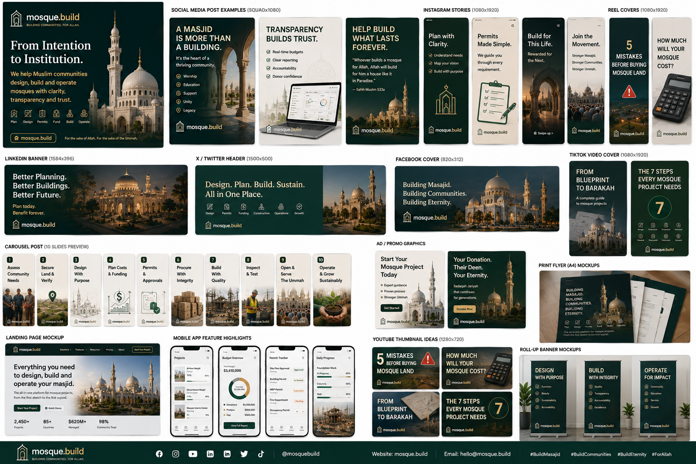

# High Resolution Marketing Style Brand Marketing

## Frame identity
- **Frame ID:** `frame_a-high-resolution-marketing-style-brand-marketing`
- **Family:** `marketing-brand`
- **Source image:** `a_high_resolution_marketing_style_brand_marketing.png`
- **Dimensions:** 1536 × 1024
- **Canonical product area:** `/`
- **Prototype route:** `/prototypes/a-high-resolution-marketing-style-brand-marketing`
- **Status:** `visual_reference`

## Purpose
This frame is a visual rendition of the **marketing-brand** product family. It must be implemented from canonical domain data and shared components; values/text embedded in the generated image are illustrative unless independently source-backed.

## Functional elements to preserve
- `landing-page`
- `social-proof`
- `lifecycle-overview`
- `feature-navigation`
- `cta`

## Required implementation states
- loading
- empty / no data
- permission denied
- stale external data where applicable
- offline or sync pending on mobile-relevant workflows
- error with recovery action
- partial/incomplete configuration
- verified vs unverified external records

## Data / safety rules
- No fabricated permit, cost, vendor, demographic, religious, or safety claim may be copied directly from the mockup.
- Display provenance and observed/verified dates for external data.
- Any regulated/safety result must preserve assumptions and professional/authority review gates.
- Costs must carry currency, geography, observed date, source, maturity and confidence.
- Public donor data must respect privacy and restricted-fund rules.

## Desktop / mobile relationship
The source may show desktop, mobile, or both. The implementation must preserve information hierarchy rather than pixel-copy the mockup. Dense tables become cards/filters/drawers on narrow screens.

## Related renditions
- None automatically grouped.

## Acceptance criteria
- [ ] Route exists and uses shared navigation/project shell.
- [ ] Primary actions are keyboard accessible.
- [ ] Every status is represented by icon/text, not color alone.
- [ ] Source-backed values expose provenance.
- [ ] Mock data is clearly fixture/demo data.
- [ ] Analytics events are declared for primary actions.
- [ ] Responsive behavior has desktop + mobile test coverage.
- [ ] Visual regression reference captured after implementation.
